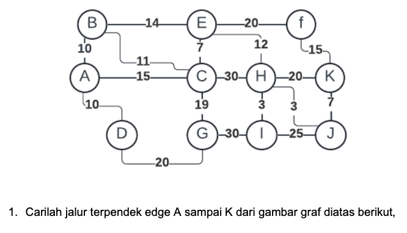
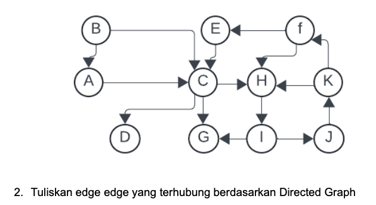

1. Path Dari Node A ke Node K : A, C, E, H, J, K \
   Path&emsp;A, C = 15,&emsp; C, E = 7,&emsp; E, H = 12,&emsp; H, J = 3,&emsp; J, K = 7 \
   Yaitu 44

2. Vertex A, B, C, D, E, F, G, H, I, J, K \
   Edges : <A, C>, <B, A>, <B, C>, <C, D>, <C, G>, \
   &emsp; &emsp; &emsp; <C, H>, <E, C>, <F, E>, <F, H>, <H, I>, \
   &emsp; &emsp; &emsp; <I, G>, <I, J>, <J, K>, <K, H>, <K, F>
