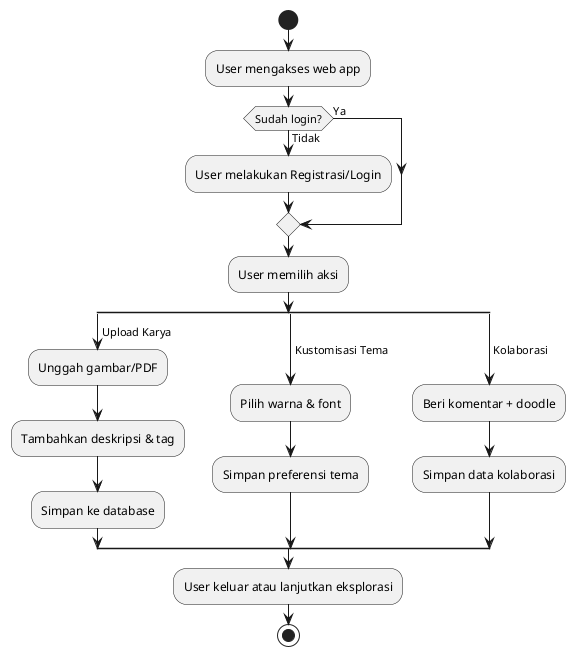
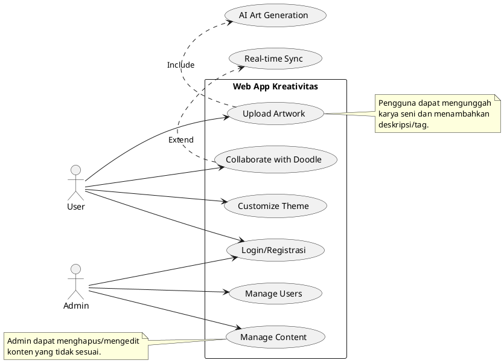
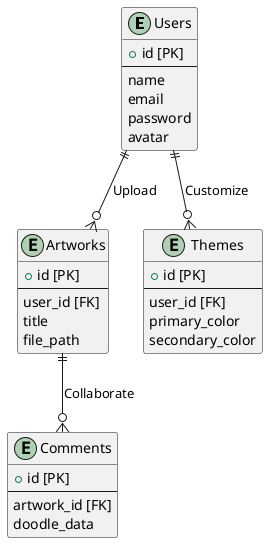

# **LAPORAN ANALISIS DAN DESAIN WEB APP KREATIVITAS BERBASIS LARAVEL**  
##### **Tanggal**: Jumat, 31 Januari 2025

##### **Disusun Oleh**: Farhan Fatahillah  

## **Daftar Isi**  
1. **Tujuan dan Ruang Lingkup**  
2. **Analisis 5W 1H**  
3. **Diagram Alir (Flowchart)**  
4. **Diagram Use Case**  
5. **Deskripsi Database**  
6. **Struktur ERD**  
7. **Teknologi dan Tools**  
8. **Kesimpulan**  

---

### **1. Tujuan dan Ruang Lingkup**  
- **Tujuan**: Membangun platform web berbasis Laravel untuk memfasilitasi ekspresi kreativitas seni melalui fitur unggah karya, kustomisasi tema, dan kolaborasi real-time.  
- **Ruang Lingkup**:  
  - Fitur Utama: Galeri seni interaktif, generator tema, kolaborasi via komentar + doodle.  
  - Target Pengguna: Seniman digital, desainer grafis, dan pengguna umum yang menyukai estetika visual.  

---

### **2. Analisis 5W 1H**  
#### **What (Apa yang Dibangun?)**  
- Web app dengan UI/UX kreatif, galeri dinamis, dan fitur kolaborasi.  

#### **Why (Mengapa Dibangun?)**  
- Meningkatkan engagement pengguna melalui desain visual yang menarik.  
- Memfasilitasi kolaborasi antar-seniman.  

#### **Who (Siapa Pengguna dan Stakeholder?)**  
- **Pengguna**: Seniman, desainer, dan umum.  
- **Stakeholder**: Tim pengembang, admin, pemilik bisnis.  

#### **When (Timeline Pengembangan?)**  
- **Fase Perancangan**: 2 minggu.  
- **Fase Pengembangan**: 6 minggu.  
- **Fase Testing**: 1 minggu.  

#### **Where (Lokasi Penerapan?)**  
- Frontend (animasi, tema), Backend (manajemen konten), Database (penyimpanan metadata).  

#### **How (Cara Implementasi?)**  
- Menggunakan Laravel untuk backend, Livewire untuk interaksi real-time, dan integrasi API AI (DALL-E).  

---

### **3. Diagram Alir (Flowchart)**  
**Deskripsi**: Alur interaksi pengguna dari login hingga upload karya dan kolaborasi.  

#### **Kode PlantUML**:  

**Output**:  
  

### **Flowchart Proses:**
- Sistem → Menyimpan tema ke database (How).

---

### **4. Diagram Use Case**  
**Deskripsi**: Use case untuk pengguna umum dan admin.  

#### **Kode PlantUML**:  

**Output**:  

### **Use Case Diagram**
- **Use Case "Upload Artwork"**:
    - Aktor: Pengguna.
    - Deskripsi: Pengguna mengunggah karya seni dengan tambahan deskripsi dan tag (What + How).

- **Use Case "Generate Custom Theme"**:
    - Aktor: Pengguna.
    - Deskripsi: Pengguna memilih warna dan font untuk personalisasi tampilan (Why + Where).

---

### **5. Deskripsi Database**  
#### **Tabel Utama**:  
| **Tabel**       | **Kolom**                          | **Deskripsi**                              |  
|-----------------|------------------------------------|--------------------------------------------|  
| `users`         | `id, name, email, password, avatar` | Menyimpan data pengguna.                   |  
| `artworks`      | `id, user_id, title, file_path`    | Menyimpan metadata karya seni.             |  
| `themes`        | `id, user_id, primary_color`       | Menyimpan preferensi tema pengguna.        |  
| `comments`      | `id, artwork_id, doodle_data`      | Menyimpan komentar dan doodle kolaborasi.  |  

#### **Relasi**:  
- `users` → `artworks` (1:N).  
- `users` → `themes` (1:N).  
- `artworks` → `comments` (1:N).  

---

### **6. Struktur ERD**  
**Kode PlantUML untuk ERD**:

### **Relasi ERD Berbasis Analisis 5W 1H:**
- What & How → Tabel artworks dan themes untuk menyimpan data kreatif.
- Who → Tabel users dengan relasi ke artworks dan comments.
- Where → Tabel comments dengan kolom doodle_data untuk menyimpan gambar kolaborasi.

**Output**:  
  

---

### **7. Teknologi dan Tools**  
| **Kategori**   | **Teknologi**                              |  
|----------------|--------------------------------------------|  
| Backend        | Laravel 10, MySQL, Redis                   |  
| Frontend       | Livewire, Alpine.js, Tailwind CSS          |  
| Desain         | Figma, Adobe Illustrator                   |  

---

### **8. Kesimpulan**  
Laporan ini merangkum analisis, desain, dan struktur teknis web app berbasis Laravel untuk kebutuhan kreativitas dan seni. Dengan menggunakan PlantUML, flowchart dan use case diagram dapat digenerate secara konsisten. Implementasi akan fokus pada **UI interaktif**, **personalisasi tema**, dan **kolaborasi real-time** untuk meningkatkan engagement pengguna.  

--- 

**Lampiran**:  
- File PlantUML untuk flowchart, use case, dan ERD.  
- Dokumen spesifikasi teknis lengkap.  