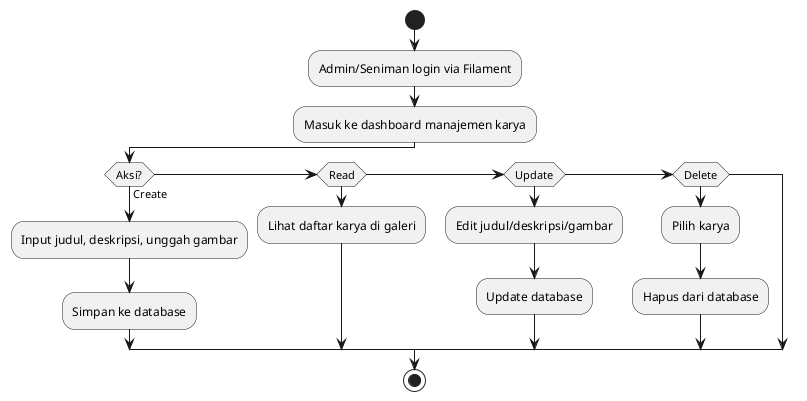
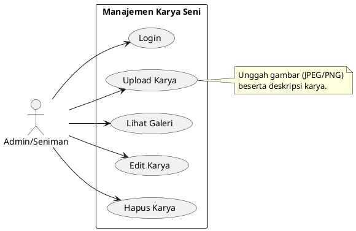
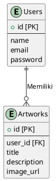

# **LAPORAN ANALISIS DAN DESAIN WEB APP MANAJEMEN KARYA SENI BERBASIS LARAVEL**  
##### **Tanggal**: Jumat, 31 Januari 2025  
##### **Disusun Oleh**: Farhan Fatahillah  

---

## **Daftar Isi**  
1. **Tujuan dan Ruang Lingkup**  
2. **Analisis 5W 1H**  
3. **Diagram Alir (Flowchart)**  
4. **Diagram Use Case**  
5. **Deskripsi Database**  
6. **Struktur ERD**  
7. **Teknologi dan Tools**  
8. **Kesimpulan**  

---

### **1. Tujuan dan Ruang Lingkup**  
- **Tujuan**: Membangun platform web berbasis Laravel untuk memudahkan seniman dalam mengelola karya seni digital melalui operasi CRUD.  
- **Ruang Lingkup**:  
  - **Fitur Utama**:  
    - **Create**: Unggah karya seni (gambar/deskripsi).  
    - **Read**: Tampilkan galeri karya.  
    - **Update**: Edit informasi karya.  
    - **Delete**: Hapus karya dari sistem.  
  - **Target Pengguna**: Seniman digital, desainer grafis, dan konten kreator.  

---

### **2. Analisis 5W 1H**  
#### **What (Apa yang Dibangun?)**  
- Sistem CRUD untuk manajemen karya seni digital dengan antarmuka admin menggunakan **Filament**.  

#### **Why (Mengapa Dibangun?)**  
- Mengatasi kesulitan seniman dalam mengorganisir portofolio digital.  
- Memfasilitasi pembaruan dan penghapusan karya secara efisien.  

#### **Who (Siapa Pengguna dan Stakeholder?)**  
- **Pengguna**: Seniman dan desainer.  
- **Stakeholder**: Admin (mengelola data via Filament).  

#### **When (Timeline Pengembangan?)**  
- **Perancangan**: 3 hari.  
- **Pengembangan**: 1 minggu.  
- **Testing**: 2 hari.  

#### **Where (Lokasi Penerapan?)**  
- Backend (Laravel + Filament), Database (MySQL), dan lingkungan Docker untuk deployment.  

#### **How (Cara Implementasi?)**  
- **Laravel**: Membangun logika CRUD.  
- **Filament**: Membuat antarmuka admin untuk manajemen data.  
- **Docker**: Containerisasi aplikasi dan database.  

---

### **3. Diagram Alir (Flowchart)**  
**Deskripsi**: Alur CRUD karya seni oleh admin/seniman.  

#### **Kode PlantUML**:  


**Output**:  
  

---

### **4. Diagram Use Case**  
**Deskripsi**: Interaksi pengguna dengan sistem.  

#### **Kode PlantUML**:  


**Output**:  
  

---

### **5. Deskripsi Database**  
#### **Tabel Utama**:  
| **Tabel**   | **Kolom**                           | **Deskripsi**                     |  
|-------------|-------------------------------------|-----------------------------------|  
| `users`     | `id, name, email, password`         | Data admin/seniman.               |  
| `artworks`  | `id, user_id, title, description, image_url` | Menyimpan metadata karya seni.    |  

#### **Relasi**:  
- `users` → `artworks` (1:N).  

---

### **6. Struktur ERD**  
**Kode PlantUML**: 



**Output**:  
  

---

### **7. Teknologi dan Tools**  
| **Kategori**   | **Teknologi**              | **Fungsi**                              |  
|----------------|----------------------------|-----------------------------------------|  
| Backend        | Laravel 10 + Filament      | CRUD operations & admin panel.          |  
| Database       | MySQL 8.0                  | Penyimpanan data pengguna dan karya.    |  
| Deployment     | Docker                     | Containerisasi aplikasi dan database.   |  

---

### **8. Kesimpulan**  
Laporan ini merancang web app manajemen karya seni berbasis **Laravel** dan **Filament** dengan fitur CRUD inti. Filament digunakan untuk membangun antarmuka admin yang efisien, sementara Docker memastikan konsistensi lingkungan pengembangan. Sistem ini ditujukan untuk membantu seniman mengorganisir portofolio digital secara terstruktur.  

--- 

**Lampiran**:  
1. **Contoh Docker Configuration**:  
   ```dockerfile
   # Dockerfile
   FROM php:8.2-apache
   RUN docker-php-ext-install pdo_mysql
   COPY . /var/www/html
   RUN chmod -R 755 /var/www/html
   ```  
   ```yaml
   # docker-compose.yml
   version: '3'
   services:
     app:
       build: .
       ports:
         - "8000:80"
       volumes:
         - .:/var/www/html
     db:
       image: mysql:8.0
       environment:
         MYSQL_ROOT_PASSWORD: root
         MYSQL_DATABASE: art_db
   ```  

2. **Struktur File Laravel + Filament**:  
   ```
   app/
     Filament/
       Resources/
         ArtworkResource.php
   database/
     migrations/
       2025_01_31_create_artworks_table.php
   resources/
     views/
       filament/
         resources/
           artwork-resource/
             list.blade.php
   ```  

--- 

**Catatan**:  
- **Filament** digunakan untuk membuat admin panel siap pakai dengan fitur CRUD otomatis.  
- **Docker** menghemat waktu setup lingkungan development dengan container MySQL dan PHP.
